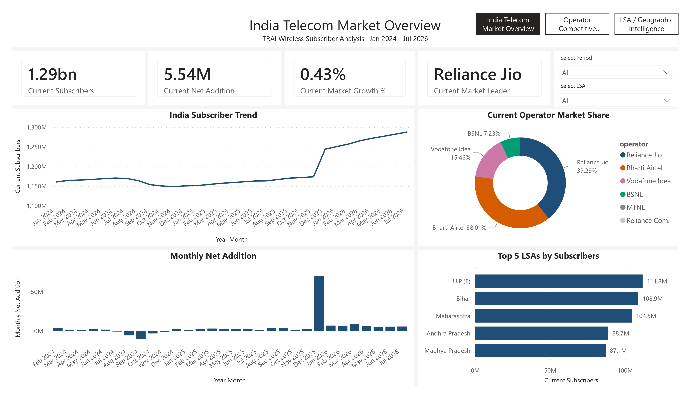
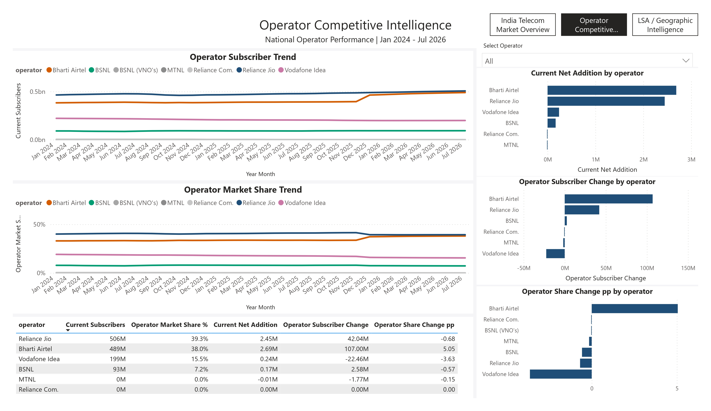
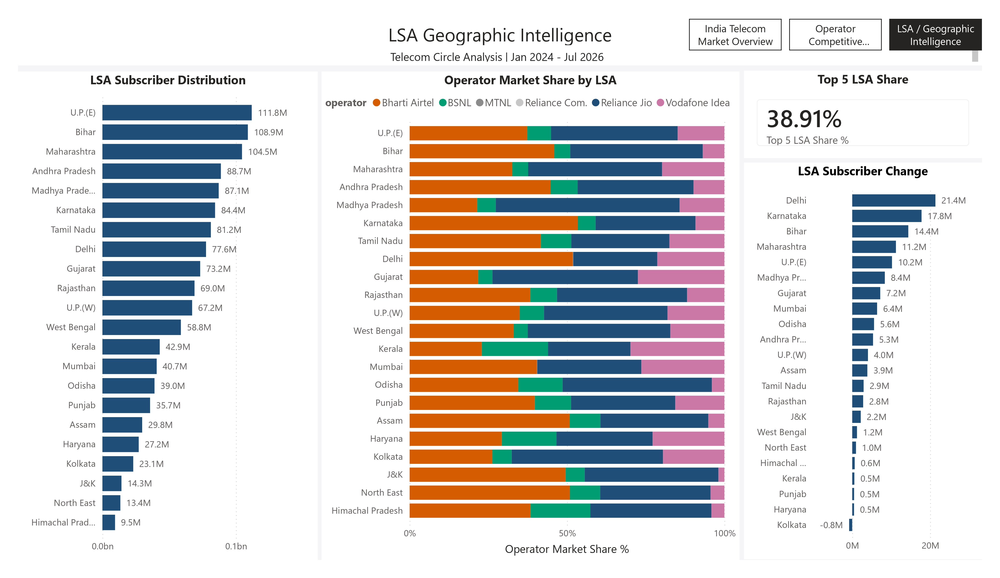

# TRAI Telecom Market Intelligence Dashboard

An interactive Power BI dashboard analyzing India's wireless telecom subscriber market using monthly TRAI data from January 2024 to July 2026.

## Project Overview

This project analyzes wireless subscriber trends, operator performance, market share, subscriber movement, and geographic differences across 22 Licensed Service Areas (LSAs) in India.

The final Power BI report contains three interactive pages:

- India Telecom Market Overview
- Operator Competitive Intelligence
- LSA Geographic Intelligence

## Business Objective

The objective of this project is to understand:

- How India's wireless subscriber base changed over time
- How telecom operators changed in subscribers and market share
- How subscriber markets differ across India's 22 LSAs
- Which operators and LSAs experienced significant subscriber movement

## Data Source

**Source:** Telecom Regulatory Authority of India (TRAI)

**Reports:** Monthly Telecom Subscription Data

**Data coverage:** January 2024 – July 2026

**Primary source table:** Annexure-II — Wireless (Mobile) Subscriber Base

**Geographic coverage:** 22 Licensed Service Areas (LSAs)

The dataset contains six current operators, with a historical BSNL (VNO's) series present in earlier periods.

## Dataset

Final analytical dataset:

**4,356 rows × 8 columns**

### Grain

One row represents:

`Period × LSA × Operator`

### Fields

- `period`
- `lsa`
- `operator`
- `previous_month_subscribers`
- `subscriber_count`
- `net_addition`
- `monthly_growth_pct`
- `market_share_pct`

## Data Preparation & Validation

The source data was consolidated into a single analytical dataset and validated before dashboard development.

Key validation steps included:

- Duplicate Period × LSA × Operator check
- Subscriber count validation
- Net addition recalculation
- Monthly growth recalculation
- LSA-level market share recalculation
- Missing and zero previous-month value checks
- Historical operator-series validation

Duplicate Period × LSA × Operator records found:

**0**

The recalculated growth metric was used as the analytical source of truth because the original derived growth field contained inconsistent scaling.

## December 2025 Data-Quality Issue

The December 2025 TRAI report used a revised November subscriber baseline.

Original November 2025 total:

**1,173,881,921**

Revised November baseline used by the December report:

**1,236,957,678**

December 2025 subscriber count:

**1,244,196,237**

Using the revised December-report baseline:

`1,244,196,237 - 1,236,957,678 = 7,238,559`

Therefore, the December report's month-on-month increase was approximately **7.24M**.

Using the unrevised November figure would create an apparent increase of approximately **70.3M** in the published series.

The project therefore:

- Preserved the original November value
- Included December 2025
- Used the revised November baseline for December's own month-on-month calculation
- Avoided interpreting the apparent ~70.3M jump as normal subscriber growth

## Power BI Data Model

The report uses a fact table and separate date dimension.

### Fact Table

`Fact_Telecom`

### Date Dimension

`Dim_Date`

### Relationship

`Dim_Date[Date]` → `Fact_Telecom[period]`

Cardinality:

**1 → many**

The date dimension covers January 2024 through July 2026, and `Year Month` is sorted chronologically using `Month Start`.

## DAX Measures

The dashboard includes dynamic measures for:

- Current Subscribers
- Current Net Addition
- Current Market Growth %
- Current Market Leader
- Monthly Net Addition
- Operator Market Share %
- Operator Share Change pp
- Operator Subscriber Change
- LSA Subscriber Change
- Top 5 LSA Share %

## Dashboard Pages

### 1. India Telecom Market Overview

Provides a national snapshot through:

- Current subscriber base
- Current net addition
- Current market growth
- Current market leader
- India subscriber trend
- Operator market share
- Monthly net addition
- Top 5 LSAs by subscribers

Interactive filters:

- Period
- LSA

### 2. Operator Competitive Intelligence

Provides operator-level analysis through:

- Operator subscriber trend
- Operator market share trend
- Operator subscriber change
- Current net addition by operator
- Operator share change
- Operator comparison table

Interactive filter:

- Operator

### 3. LSA Geographic Intelligence

Provides geographic analysis across all 22 LSAs through:

- LSA subscriber distribution
- Operator market share by LSA
- LSA subscriber change
- Top 5 LSA share

## Key Findings

### National Market

India's wireless subscriber base increased from approximately **1.161B in January 2024** to **1.288B in July 2026**, an endpoint increase of approximately **127.21M (+10.96%)**.

### Operator Movement

From January 2024 to July 2026:

- Bharti Airtel: **+107.00M**
- Reliance Jio: **+42.04M**
- BSNL: **+2.58M**
- Vodafone Idea: **−22.46M**

### July 2026 Market Share

- Reliance Jio: **39.29%**
- Bharti Airtel: **38.01%**
- Vodafone Idea: **15.46%**
- BSNL: **7.23%**

### Geographic Concentration

The five largest LSAs represented approximately **38.91%** of the national subscriber base in July 2026.

Largest LSAs:

- U.P.(E): **111.81M**
- Bihar: **108.92M**
- Maharashtra: **104.54M**
- Andhra Pradesh: **88.72M**
- Madhya Pradesh: **87.09M**

### Karnataka Example

July 2026 Karnataka subscriber base:

**84.37M**

Operator shares:

- Airtel: **53.44%**
- Jio: **31.74%**
- Vodafone Idea: **9.19%**
- BSNL: **5.63%**

## Tools & Technologies

- Power BI
- DAX
- Python
- Pandas
- Excel / CSV
- TRAI public reports

## Dashboard Preview

### Page 1 — India Telecom Market Overview

### Page 2 — Operator Competitive Intelligence

### Page 3 — LSA Geographic Intelligence

## Project Files

- [Final Analytical Dataset](data/TRAI_mobile_lsa_analysis_FINAL.csv)
- [Power BI Report](powerbi/TRAI_Telecom_Market_Intelligence.pbix)
- [PDF Report](powerbi/TRAI_Telecom_Market_Intelligence.pdf)
- [Detailed Operator Strategy & Market Intelligence Report](docs/Indian_Telecom_Operator_Strategy_Market_Intelligence_2026.pdf)
